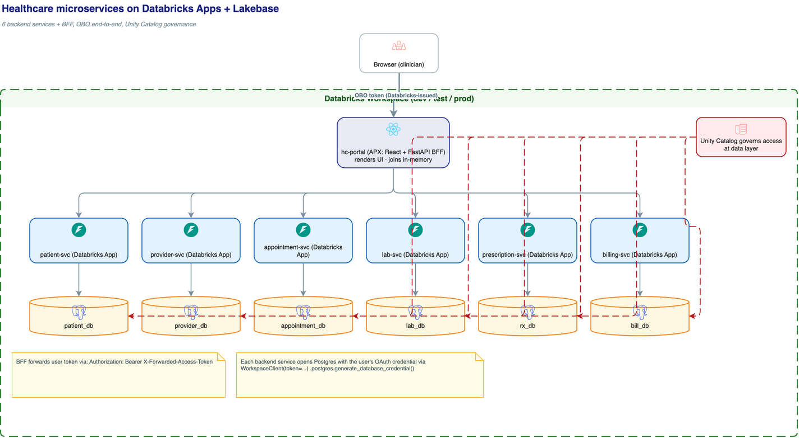
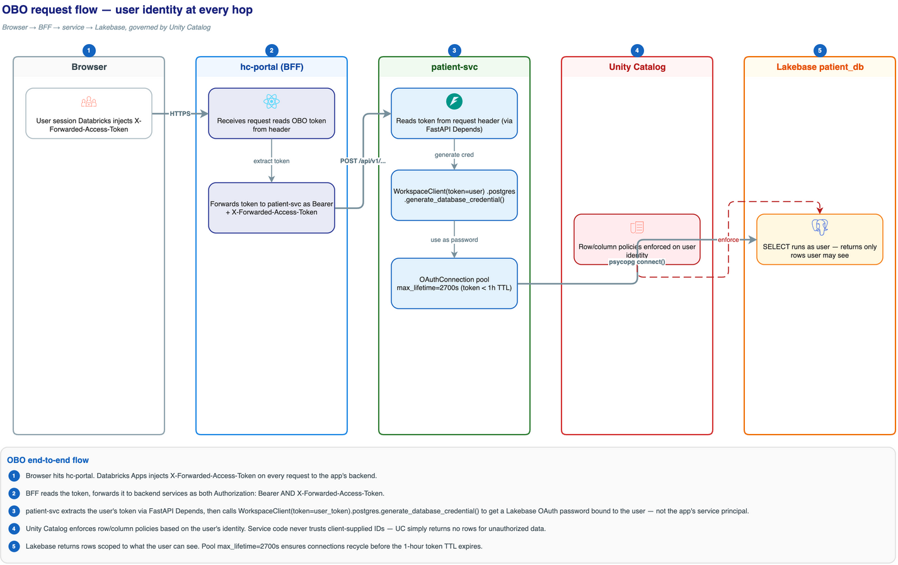
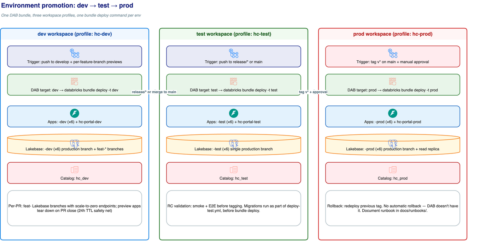
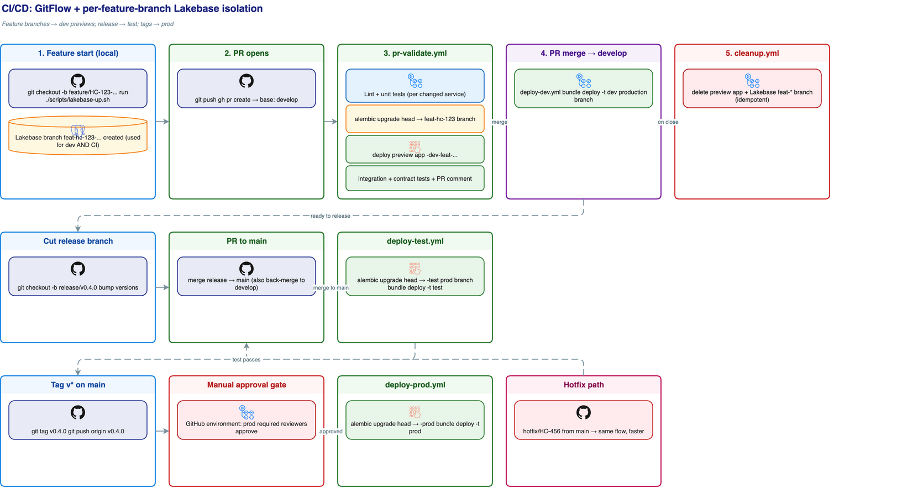

<p align="center">
  
</p>

# Architecture

This document explains *what* this reference architecture is, *why* each piece is shaped the way it is, and *where* to find the patterns it codifies. For the data model, see [`HEALTHCARE_DATA_MODEL.md`](HEALTHCARE_DATA_MODEL.md). For the GitFlow + CI/CD rules, see [`CONTRIBUTING.md`](CONTRIBUTING.md).

---

## Goals

A reference for teams who want to:

1. Build microservices on **Databricks Apps** instead of standing up Kubernetes.
2. Use **Lakebase** as a per-service operational store with **per-feature-branch isolation** — one Lakebase branch per code branch, used for both local development *and* PR CI.
3. Govern access through **Unity Catalog** with **OBO** identity passthrough — no service-account shortcuts.
4. Deploy with **Databricks Asset Bundles** (DABs) across three workspaces using a single `bundle deploy` command.
5. Treat the codebase as a monorepo while keeping services independent (separate apps, separate DBs, no cross-service joins).

What this is **not**: a HIPAA-certified production system, a FHIR implementation, or a how-to for k8s/Istio/etc.

---

## Topology



```
┌─────────────────────────────────────────────────────────────┐
│                  Browser (clinician/admin)                   │
└─────────────────────────────────────────────────────────────┘
                       │  cookies + Databricks-issued OBO token
                       ▼
┌─────────────────────────────────────────────────────────────┐
│  hc-portal (Databricks App: APX, React + FastAPI BFF)       │
│  ─ Renders UI                                                │
│  ─ Owns no data                                              │
│  ─ Reads X-Forwarded-Access-Token, forwards to services     │
│  ─ Joins/aggregates results in-memory                       │
└─────────────────────────────────────────────────────────────┘
        │  Authorization: Bearer <user OBO token>
        │  X-Forwarded-Access-Token: <same token>
        ▼
┌──────────┬──────────┬───────────┬──────────┬──────────┬──────────┐
│ patient  │ provider │appointment│   lab    │ rx (Rx)  │ billing  │
│   svc    │   svc    │    svc    │   svc    │   svc    │   svc    │
│ (Apps)   │ (Apps)   │  (Apps)   │ (Apps)   │ (Apps)   │ (Apps)   │
└──────────┴──────────┴───────────┴──────────┴──────────┴──────────┘
     │          │           │          │          │          │
     ▼          ▼           ▼          ▼          ▼          ▼
┌──────────┬──────────┬───────────┬──────────┬──────────┬──────────┐
│ patient_ │provider_ │appointment│ lab_db   │  rx_db   │bill_db   │
│   db     │   db     │    _db    │          │          │          │
│(Lakebase)│(Lakebase)│ (Lakebase)│(Lakebase)│(Lakebase)│(Lakebase)│
└──────────┴──────────┴───────────┴──────────┴──────────┴──────────┘
                            ▲
                            │
                  Unity Catalog governs access at
                  the data layer — every Postgres
                  session is opened with the user's
                  OAuth credential.
```

### What's a "service"

A service in this architecture is a **single Databricks App** that:

- Lives in `services/<name>/` as a self-contained APX project (FastAPI + optional React admin UI).
- Owns *exactly one* Lakebase project per env (named `<svc>` in each workspace; env is implicit in the workspace).
- Exposes a versioned REST API (`/api/v1/...`) consumed only by the BFF — never by the browser directly.
- References data owned by other services **only by ID** (UUID columns, no FKs across DB boundaries).

### What's the BFF

`hc-portal` is a single Databricks App with two surfaces:

- A React frontend (the actual UI).
- A FastAPI backend that acts as a **Backend-For-Frontend** — the *only* component allowed to call multiple services and join their results.

The BFF holds **no persistent state of its own**. If it ever needs caching, it's request-scoped (e.g. `lru_cache` per request) — no Redis, no shared cache. If joins become hot or expensive, push them down to Unity Catalog as a federated view rather than caching them in the BFF.

---

## Authentication & authorization (OBO, end-to-end)



The non-negotiable rule: **every Postgres session opens with the calling user's OAuth credential.** No "service runs as a service principal that can read everything" shortcut.

### Step-by-step

1. **Browser → frontend app.** User signs in via Databricks Apps' built-in identity. Databricks injects `X-Forwarded-Access-Token` on every HTTP request to the app's backend.
2. **Frontend → BFF.** The React app calls the BFF's `/api/...` routes. The token rides along automatically (same origin).
3. **BFF → backend services.** For each downstream call, the BFF copies the user's token into both `Authorization: Bearer ...` and `X-Forwarded-Access-Token` headers. This makes the call OBO-correct from the service's perspective.
4. **Backend service → Lakebase.** The service:
   - Parses the bearer token from `Authorization`.
   - Builds a `WorkspaceClient(token=user_token)` (no service-principal fallback when running in production).
   - Calls `ws.postgres.generate_database_credential(endpoint=ENDPOINT_NAME)` — this returns a Postgres OAuth credential bound to *the user*, not the app's service principal.
   - Opens a connection with that credential as the password (TTL ~1h, `OAuthConnection.connect()` regenerates on demand, pool `max_lifetime=2700`s).
5. **Lakebase + UC.** Postgres role mapping + UC's row/column-level controls enforce what the user can see. Service code never has to trust client-supplied identifiers — if a user requests `patient_id=X` they don't have access to, the query simply returns nothing.

### Why this matters

- **Auditability**: Postgres logs the *user's* email/identity, not a generic service principal.
- **Defense in depth**: a compromised service can't escalate its own privileges, because it has no privileges of its own — it only ever acts on behalf of the calling user.
- **Cross-service consistency**: the BFF can't fabricate a request — every service hop re-validates the same user token against the same UC permissions.

The canonical code pattern is in [`./.claude/skills/hc-obo-auth/references/canonical-patterns.md`](.claude/skills/hc-obo-auth/references/canonical-patterns.md).

---

## Why monorepo

The repo is one monorepo, not 8 polyrepos. The independence story is:

| Concern | How it's enforced |
|---|---|
| Independent deploys | One Databricks App per service, one DAB resource file per service |
| Independent data | One Lakebase project per service, no cross-DB FKs, no shared schema |
| Independent dependencies | uv workspace — each `services/<name>/pyproject.toml` is its own dependency tree |
| Independent ownership | `CODEOWNERS` per service, blocks merges without service-owner review |
| Independent CI | `pr-validate.yml` uses `paths:` filters + a matrix over `services/*` so changes to `lab/` only spin up `lab`'s Lakebase branch |
| No accidental coupling | No backend-to-backend HTTP calls; no shared library between services in v1 |

Repo boundaries aren't what makes services independent — those five rules are. See [`CONTRIBUTING.md`](CONTRIBUTING.md) for the enforcement details.

---

## Environments

Three Databricks workspaces, three DAB targets, three CLI profiles:

| Env | Workspace profile | DAB target | Triggered by | Lakebase project naming |
|---|---|---|---|---|
| dev | `hc-dev` | `dev` | push to `develop`, plus per-feature-branch previews | `<svc>`, with `production` branch + `feat-<slug>` branches |
| test | `hc-test` | `test` | push to `release/*`, merge to `main` | `<svc>`, single `production` branch |
| prod | `hc-prod` | `prod` | tag `v*` + manual approval | `<svc>`, `production` branch + (planned) read-only replica endpoint |

Each workspace IS its own environment, so project/app names are unsuffixed; the env is implicit in the workspace they live in.



Each workspace is its own environment, so app names are unsuffixed in trunk deploys — `databricks bundle deploy -t dev` produces `patient`, `lab`, `hc-portal`, etc., and `-t prod` produces the same names in the prod workspace. Per-feature-branch previews override `app_name_suffix=-feat-<slug>` so they live alongside the trunk deploy (e.g. `patient-feat-hc-123`).

---

## CI/CD



Six GitHub Actions workflows under `.github/workflows/` (`pr-validate`, `pr-cleanup`, `deploy-{dev,test,prod}`, `nightly-orphan-cleanup`), all pinned to Databricks CLI `1.2.1` and authenticated via M2M service-principal client-credentials (no long-lived PATs — OIDC trust is the documented migration path):

### Feature branches: code + DB in lockstep

Every code branch has a matching Lakebase branch. Created at feature start (locally), kept alive across all pushes, deleted at PR close/merge.

```
feature/HC-123-add-allergies   ←→   projects/<svc>/branches/feat-hc-123-add-allergies
```

**At feature start** — use `scripts/lakebase-branch-up.sh` (the canonical idempotent verb that the workflows also call):

```bash
SLUG=$(./scripts/sanitize-branch-slug.sh "$(git branch --show-current)")
./scripts/lakebase-branch-up.sh patient dev "feat-$SLUG"
```

Under the hood it calls `databricks postgres create-branch` (`source_branch=projects/<svc>/branches/production`) and then `create-endpoint` with `autoscaling_limit_{min,max}_cu = 0.5 / 2.0`. The dev's local `.env` points `ENDPOINT_NAME` at the new endpoint; `apx dev start` runs against it.

### `pr-validate.yml` (the interesting one)

On any PR against `develop` / `release/*` / `main`, for each changed `services/*`:

1. Lint + unit tests (matrix over services; portal tests in their own job).
2. **Look up or create** the matching Lakebase feature branch (idempotent — covers contributors who skipped the local step). All six are provisioned, not just the changed ones, so every app's `postgres` resource reference still resolves; alembic only runs against the services the PR actually touched.
3. Build every apx frontend (`scripts/build-frontends.sh` → `apx frontend build` per project) so the React UIs ship inside the bundle.
4. `databricks bundle deploy -t dev --var "app_name_suffix=-<slug>" --var "lakebase_branch=feat-<slug>"` — wires the preview apps' names, source dirs, and Lakebase bindings in one call.
5. `databricks bundle run` per app, fired in parallel — submits a new app deployment from the synced source and waits until each reaches `RUNNING`.
6. Strict `/healthz` smoke (status `200` AND body exactly `{"ok":true}` — Apps' OBO gateway returns 200-with-HTML for unauthenticated requests, which would fool a vanilla `curl -fsS`).
7. Resolve each preview app's canonical URL via `databricks apps get <name> -o json` (the platform embeds the workspace ID into the hostname, so it can't be constructed client-side) and post the table to the PR.
8. **On PR close/merge:** `pr-cleanup.yml` runs `bundle destroy` + tears down all six Lakebase feature branches.

Subsequent pushes to the same feature branch reuse the same DB branch and preview apps — schema migrations and seed data persist across pushes, so the dev's local state and CI's state are the same state.

A safety net: branches are created **without** `no_expiry`, so the platform's default TTL (24h of inactivity → delete) cleans them up if the workflow fails to. Endpoints scale to zero when idle, so an inactive feature branch costs ~$0.

### `deploy-dev.yml`, `deploy-test.yml`, `deploy-prod.yml`

Each follows the same shape as `pr-validate.yml` minus the per-PR scoping:

1. Path-unscoped lint + unit tests across all six services + the BFF.
2. Write the env's `~/.databrickscfg` profile from `vars.DATABRICKS_HOST_<ENV>` + `secrets.DATABRICKS_CLIENT_{ID,SECRET}`.
3. Ensure the six Lakebase projects exist (idempotent via `scripts/lakebase-project-up.sh`).
4. Run `alembic upgrade head` against each service's `production` Lakebase branch BEFORE the deploy — running migrations after the app deploys means a brief window of broken prod.
5. Build every apx frontend.
6. `databricks bundle deploy -t <env>` followed by parallel `databricks bundle run` per app, then `apps get` polling until each reaches `RUNNING`.
7. Strict `/healthz` smoke against every app, using a short-lived bearer minted via the OAuth `client_credentials` flow (`${DATABRICKS_HOST}/oidc/v1/token`).
8. Final step resolves `hc-portal`'s canonical URL from `apps get` and feeds it into the GitHub `environment.url` so the Environments tab points at the real workspace-qualified Apps URL.

`deploy-prod.yml` adds an `environment: prod` GitHub gate for manual approval and runs only on tag pushes (`v*`).

The local equivalent of every step lives in `scripts/ci-local.sh` (lint/test/deploy from a developer's workstation, against `~/.databrickscfg` profiles instead of GitHub-injected env secrets) and `scripts/deploy-and-run-bundle.sh` (the `bundle deploy` + per-app `bundle run` combo as a standalone verb with `--only` / `--skip-deploy` / `--restart` / `--no-wait` / `--var` passthrough).

The full ruleset lives in [`./.claude/skills/hc-gitflow-cicd/SKILL.md`](.claude/skills/hc-gitflow-cicd/SKILL.md).

---

## Why these tools

**APX** — gives every service a consistent FastAPI + React scaffold with auto-generated typed frontend hooks (Orval). The BFF clients can be Orval-generated too, so the BFF gets type-safe access to every service without hand-written client code.

**Lakebase Autoscale** — the branching feature is the headline. It's effectively `git checkout` for Postgres. Per-PR isolation that would require Aurora cloning + a custom orchestrator on AWS becomes a single CLI call.

**DABs** — one bundle file declares every app + every Lakebase project + every job; one `databricks bundle deploy -t prod` deploys atomically. No Helm, no Terraform, no per-service Kubernetes manifests.

**Unity Catalog** — the only governance layer. Postgres roles + UC RLS handle row-level access; service code never enforces auth itself.

**GitHub Actions** — for CI/CD, authenticated to Databricks via M2M service-principal `client_credentials` (one SP per env, scoped to the matching GitHub environment's secrets). Standard, free for public repos, integrates with `gh` for PR comments. OIDC trust is the documented migration path once it's available on each workspace.

---

## Trade-offs and known limitations

- **No event bus in v1.** Services communicate request/response only. If you need eventual consistency (e.g. "when an appointment is booked, billing creates a draft invoice"), wire a Lakeflow pipeline that reads from each service's CDC stream — out of scope here.
- **BFF is a single point of fan-out.** A slow service degrades every page that depends on it. For a real production system, add per-call timeouts (already in the BFF skill), circuit breakers, and partial-failure rendering. The reference includes timeouts; circuit breakers are an open issue.
- **No service mesh.** Apps-to-Apps traffic is direct HTTPS. Acceptable for this domain; if you need zero-trust between services, you'd front each with an internal-only Apps URL and lean on Databricks' network ACLs.
- **One Lakebase project per service per env.** Per-service compute floors mean six (services) × three (envs) × one minimum CU = at least 9 CUs of always-on cost (or zero with scale-to-zero). Watch this on the prod side.
- **The reference data model is illustrative.** It's HL7-FHIR-shaped but not FHIR-conformant.
- **HIPAA**: this repo is not a HIPAA implementation. PHI handling, BAAs, encryption-at-rest beyond Lakebase defaults, audit log retention, etc. are explicitly your problem.

---

## Related skills

The patterns described here are operationalized by six project-local skills under `.claude/skills/`. Each is auto-discovered by Claude Code when working in this repo.

- [`hc-microservice-scaffold`](.claude/skills/hc-microservice-scaffold/SKILL.md) — add a new service end-to-end.
- [`hc-lakebase-branching`](.claude/skills/hc-lakebase-branching/SKILL.md) — branch lifecycle for PR previews.
- [`hc-obo-auth`](.claude/skills/hc-obo-auth/SKILL.md) — wire OBO into a route or a service.
- [`hc-dab-deployment`](.claude/skills/hc-dab-deployment/SKILL.md) — deploy + promote across envs.
- [`hc-bff-pattern`](.claude/skills/hc-bff-pattern/SKILL.md) — BFF aggregation patterns.
- [`hc-gitflow-cicd`](.claude/skills/hc-gitflow-cicd/SKILL.md) — branch & release rules.
