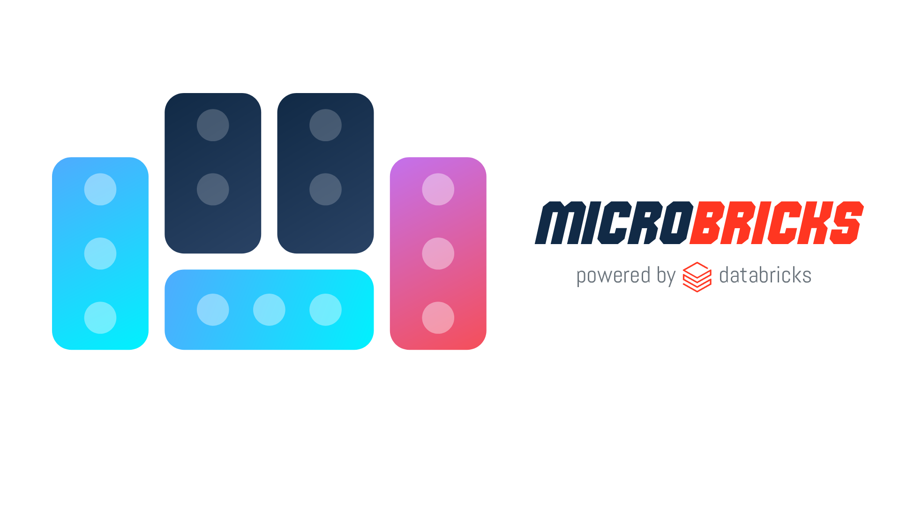

<p align="center">
  
</p>

<p align="center">
  <em>A solution accelerator for building microservices on Databricks.</em>
</p>

<p align="center">
  <a href="https://github.com/erinaldidb/microbricks/actions/workflows/deploy-dev.yml"></a>
  <a href="https://github.com/erinaldidb/microbricks/actions/workflows/deploy-test.yml"></a>
  <a href="https://github.com/erinaldidb/microbricks/actions/workflows/deploy-prod.yml"></a>
  <a href="https://github.com/erinaldidb/microbricks/actions/workflows/pr-validate.yml"></a>
  
  <a href="LICENSE"></a>
  <a href="CONTRIBUTING.md"></a>
  
</p>
<p align="center">
  
  
  
  
  
</p>
<p align="center">
  
  
  
  
  
  
  
  
</p>
<p align="center">
  
  
  
  
  
  
  
  
</p>

---

**microbricks** demonstrates how to build microservices on Databricks using **Databricks Apps** for the runtime, **Lakebase Autoscale Postgres** for per-service state, **OBO authentication** for end-to-end user identity, and **DABs + GitHub Actions** for CI/CD across dev/test/prod.

The demo domain is healthcare: six backend services that loosely follow HL7 FHIR resource boundaries, plus one frontend portal with an in-process BFF.

> **Status:** Phases 1–7 complete — six backend services + the BFF + the DAB bundle + six GitHub Actions workflows are all in place. The workflows now run end-to-end against the dev workspace via M2M (service-principal) auth, build every apx frontend, deploy all seven apps in parallel, and resolve each app's canonical URL (with workspace ID) from the apps API. Dev is also fully runnable from a workstation via `scripts/ci-local.sh`. See [`ROADMAP.md`](ROADMAP.md) for the full phase breakdown and [open work](#open-work) for what's next.

---

## At a glance

```
Browser  →  hc-portal (frontend + BFF)  →  6 backend services  →  6 Lakebase databases
            └── REST /api/bff/...           └── one DB per service, no shared schema
            └── GraphQL /api/graphql        └── each exposes /api/graphql (Strawberry)
            └── forwards OBO token
```

- **6 backend services** (`patient`, `provider`, `appointment`, `lab`, `prescription`, `billing`), each its own Databricks App with its own Lakebase project. Each exposes both REST (`/api/v1/`) and GraphQL (`/api/graphql`) endpoints via Strawberry.
- **1 frontend** (`hc-portal`) — a [BFF](https://samnewman.io/patterns/architectural/bff/) that orchestrates calls and joins data in-memory. Holds no data of its own. Exposes a **GraphQL gateway** at `/api/graphql` with DataLoader-based batch resolution and nested cross-service traversal.
- **OBO auth** end-to-end. Every Postgres connection is opened with the calling user's OAuth credential, so Unity Catalog enforces access at the data layer.
- **No backend-to-backend calls.** The BFF is the only place where data from multiple services is joined.
- **Dual API surface.** REST endpoints remain stable; GraphQL coexists and enables field selection, nested traversal, and partial-failure handling natively. The frontend is being migrated page-by-page from React Query (REST) to Apollo Client (GraphQL).

Detailed architecture: [`ARCHITECTURE.md`](ARCHITECTURE.md). Data model: [`HEALTHCARE_DATA_MODEL.md`](HEALTHCARE_DATA_MODEL.md). Implementation plan: [`ROADMAP.md`](ROADMAP.md). Brand assets: [`docs/brand/`](docs/brand/README.md).

---

## Prerequisites

| Tool              | Min version | Install                                                                |
| ----------------- | ----------- | ---------------------------------------------------------------------- |
| Databricks CLI    | `1.2.1`     | `brew install databricks` (the GitHub Actions workflows pin `1.2.1`)   |
| `apx`             | latest      | `curl -fsSL https://databricks-solutions.github.io/apx/install.sh \| sh` |
| `uv`              | latest      | `curl -LsSf https://astral.sh/uv/install.sh \| sh`                       |
| `bun`             | latest      | `curl -fsSL https://bun.sh/install \| bash`                              |
| `gh`              | latest      | `brew install gh`                                                      |
| `psql` (optional) | 16          | `brew install postgresql@16`                                           |

`apx` + `bun` are needed at deploy time (CI and local) because each apx project's React UI is built into `src/<pkg>/__dist__/` before `bundle deploy` — see [`scripts/build-frontends.sh`](scripts/build-frontends.sh).


Three Databricks workspaces (FE-VM serverless type, required for Lakebase + Apps):


| Profile   | Workspace          | Used for                                                                    |
| --------- | ------------------ | --------------------------------------------------------------------------- |
| `hc-dev`  | dev workspace URL  | `develop` branch + per-feature-branch preview environments (local dev + PR) |
| `hc-test` | test workspace URL | `release/*` branches and `main` HEAD                                        |
| `hc-prod` | prod workspace URL | tagged releases (`v*`)                                                      |


Configure them in `~/.databrickscfg`:

```bash
databricks auth login --host https://<dev-workspace>.cloud.databricks.com --profile hc-dev
databricks auth login --host https://<test-workspace>.cloud.databricks.com --profile hc-test
databricks auth login --host https://<prod-workspace>.cloud.databricks.com --profile hc-prod
```

---

## Quickstart

```bash
# 1. Clone
git clone https://github.com/erinaldidb/microbricks.git
cd microbricks

# 2. Validate the bundle (no Databricks calls, just YAML + schema checks)
databricks bundle validate -t dev

# 3. Bootstrap dev: lint + tests + provision 6 Lakebase projects + alembic +
#    build frontend UIs + `bundle deploy -t dev` + `bundle run` per app +
#    /healthz smoke. ci-local.sh wraps every step the GitHub Actions
#    `deploy-dev.yml` workflow runs in CI.
./scripts/ci-local.sh deploy dev

# 4. Seed synthetic patient/provider/appointment/lab/prescription/billing
#    data into the freshly-provisioned production branches.
make seed-dev
```

The seven dev apps (`patient`, `provider`, `appointment`, `lab`, `prescription`, `billing`, `hc-portal`) come up RUNNING — the `bundle run` step in CI submits an app deployment per app in parallel and waits for `RUNNING` state. Lakebase endpoints scale to zero after 1h idle, so an inactive dev environment is ~$0.

Already have a deployed bundle and just want to (re-)launch the apps? Use the standalone helper:

```bash
# Plain trunk-dev: deploy bundle, then start all seven apps (parallel-friendly)
./scripts/deploy-and-run-bundle.sh dev

# Already deployed — just kick a new app deployment per app
./scripts/deploy-and-run-bundle.sh dev --skip-deploy --restart

# Iterate on a subset
./scripts/deploy-and-run-bundle.sh dev --only=patient,lab
```

For the per-PR / per-feature-branch workflow:

```bash
# Day-to-day fast loop: lint + tests + bundle-validate, no deploy.
./scripts/ci-local.sh pr-validate --no-deploy

# Full preview deploy: provision 6 feature branches off `production`, alembic
# on changed services, deploy 7 preview apps suffixed `-<slug>`, smoke-test.
./scripts/ci-local.sh pr-validate

# Tear it all down when you're done iterating.
./scripts/ci-local.sh pr-cleanup
```

See `CONTRIBUTING.md` "Running CI locally" for the full reference. Every step can also be driven by Claude Code — open the repo in Claude Code and the project-local skills (`.claude/skills/`) are auto-discovered.

---

## Repository layout

```
.
├── README.md                       # This file
├── ARCHITECTURE.md                 # Architecture reference
├── HEALTHCARE_DATA_MODEL.md        # Per-service data model
├── CONTRIBUTING.md                 # GitFlow + PR rules + "Running CI locally"
├── ROADMAP.md                      # Phased implementation plan (all phases ✅ except 8)
├── Makefile                        # `make seed-dev` and per-service seed targets
├── databricks.yml                  # Root DAB (3 targets: dev / test / prod)
├── resources/                      # DAB resource includes (apps + BFF + shared)
├── services/                       # 6 backend microservices (one APX project each)
│   ├── patient/                    # ✅ all six scaffolded; auth.py / db.py / migrations
│   ├── provider/                   #     are byte-identical except for entity names
│   ├── appointment/                #     each exposes REST + GraphQL (Strawberry)
│   ├── lab/
│   ├── prescription/
│   └── billing/
├── frontend/
│   └── hc-portal/                  # ✅ React UI + BFF; REST aggregation + GraphQL
│                                   #     gateway with DataLoaders + Apollo Client
├── scripts/
│   ├── ci-local.sh                 # Local CI emulator — pr-validate / pr-cleanup /
│   │                               #     deploy {dev,test,prod} / nightly-cleanup
│   ├── build-frontends.sh          # Auto-discovers apx projects under frontend/
│   │                               #     and runs `apx frontend build` for each
│   ├── deploy-and-run-bundle.sh    # `bundle deploy` + per-app `bundle run` in
│   │                               #     one verb (with --only / --skip-deploy /
│   │                               #     --restart / --no-wait / --var passthrough)
│   ├── sanitize-branch-slug.sh     # Code-branch -> Lakebase-/preview-slug transform
│   ├── lakebase-project-{up,down}.sh   # Per-env Lakebase project lifecycle
│   ├── lakebase-branch-{up,down}.sh    # Per-feature-branch lifecycle
│   └── seeds/                      # Shared seed primitives (deterministic UUIDs)
├── tests/seeds/                    # Cross-service ID-stability tests (no DB needed)
├── docs/
│   ├── brand/                      # Logo + icon + Photoshop source
│   └── diagrams/                   # *.drawio + exported *.png
├── .github/
│   ├── workflows/                  # 6 workflows: pr-validate, pr-cleanup,
│   │                               # deploy-{dev,test,prod}, nightly-orphan-cleanup
│   └── release-template.md         # PR template for release/* -> main PRs
└── .claude/                        # Project-local Claude Code skills (auto-discovered)
    └── skills/
        ├── hc-microservice-scaffold/
        ├── hc-lakebase-branching/
        ├── hc-obo-auth/
        ├── hc-dab-deployment/
        ├── hc-bff-pattern/
        └── hc-gitflow-cicd/
```

---

## Working with this repo via Claude Code

The repo ships six project-local skills under `.claude/skills/`. Each one codifies a piece of the reference architecture so that future contributors (and Claude Code itself) follow the same patterns.


| Ask Claude Code…                                            | Skill that fires           |
| ----------------------------------------------------------- | -------------------------- |
| "Scaffold a new service called X"                           | `hc-microservice-scaffold` |
| "Spin up a Lakebase branch for my feature" / "tear it down" | `hc-lakebase-branching`    |
| "Add a new route to the patient service"                    | `hc-obo-auth`              |
| "Deploy to test"                                            | `hc-dab-deployment`        |
| "Add a BFF endpoint that joins patient + appointment"       | `hc-bff-pattern`           |
| "Add a GraphQL query / migrate a page to GraphQL"           | `hc-graphql`               |
| "Cut a release / open a PR"                                 | `hc-gitflow-cicd`          |


---

## CI/CD

The repo ships six workflows under `.github/workflows/`, all pinned to Databricks CLI `1.2.1`:

| Workflow                     | Trigger                                           | What it does                                                                                                                                                                                                                                                                                  |
| ---------------------------- | ------------------------------------------------- | --------------------------------------------------------------------------------------------------------------------------------------------------------------------------------------------------------------------------------------------------------------------------------------------- |
| `pr-validate.yml`            | PR open/sync against `develop`/`release/*`/`main` | Path-scoped matrix: lint + unit tests for changed services, BFF tests, bundle-validate, provision per-feature Lakebase branches, alembic, build apx frontends, parallel `bundle deploy` + per-app `bundle run`, /healthz smoke, resolve canonical URLs from the apps API, comment URLs on PR |
| `pr-cleanup.yml`             | PR close (merged or not)                          | `bundle destroy` of the preview + tear down 6 Lakebase feature branches                                                                                                                                                                                                                       |
| `deploy-dev.yml`             | Push to `develop`                                 | Same shape (no path filter, all six services + portal): alembic on `production` branches, build frontends, `bundle deploy -t dev`, parallel `bundle run` per app, wait for `RUNNING`, /healthz smoke                                                                                          |
| `deploy-test.yml`            | Push to `release/*` or `main`                     | Same shape, `-t test`                                                                                                                                                                                                                                                                         |
| `deploy-prod.yml`            | Push tag `v*` on `main`                           | Same shape, `-t prod`, gated by manual approval on the `prod` GitHub environment                                                                                                                                                                                                              |
| `nightly-orphan-cleanup.yml` | Daily cron (04:17 UTC) + manual                   | GC Lakebase feature branches whose PR is closed                                                                                                                                                                                                                                               |

A few details worth knowing:

- **Auth: M2M (service-principal) via the OAuth `client_credentials` flow.** Each deploy job writes a `~/.databrickscfg` profile (`hc-dev` / `hc-test` / `hc-prod`) from `vars.DATABRICKS_HOST_<ENV>` + `secrets.DATABRICKS_CLIENT_ID` + `secrets.DATABRICKS_CLIENT_SECRET` scoped to the matching GitHub environment. Smoke tests mint a short-lived bearer by POSTing `client_credentials` to `${DATABRICKS_HOST}/oidc/v1/token` (no PATs, no `databricks auth token` — that's U2M-only). OIDC trust is the documented migration path; the inline rationale lives in `pr-validate.yml`.
- **Frontends are built in CI.** `scripts/build-frontends.sh` auto-discovers every apx project under `frontend/` (anything with both `pyproject.toml` and `package.json`) and runs `apx frontend build` — `bundle deploy` only syncs files, so without this step the deployed app would 404 on every page route. The bundle force-includes the resulting `src/<pkg>/__dist__/` via `sync.include` in `databricks.yml`.
- **Apps deploy in parallel.** `bundle deploy` wires the cross-app `CAN_USE` ACLs at deploy-time, so the seven `bundle run` calls (six services + `hc-portal`) fire concurrently. Wall time becomes `max(app startup)` rather than `sum`. Each subshell logs to its own file so a failure surfaces a clean log instead of interleaved noise.
- **Smoke tests are strict.** Both the status code AND the body are asserted (`200` + literal `{"ok":true}`) — Databricks Apps' OBO gateway returns 200-with-HTML for unauthenticated requests, which would fool a vanilla `curl -fsS`.
- **Environment URLs come from the apps API.** The Apps platform embeds the workspace ID into each app hostname (e.g. `hc-portal-7405606704848118.18.azure.databricksapps.com`), so we can't construct it client-side. Each deploy workflow's final step calls `databricks apps get hc-portal -o json` and feeds the canonical URL into `environment.url` and (for previews) into the PR comment table.

> **Note:** GH-hosted runners may not reach the dev workspace if FE-VM's managed IP allowlist is in effect — see the `github-runner-ip-acl` finding. Where that's the case, `scripts/ci-local.sh` runs the same logical pipelines from a developer's machine where the IP is already allowlisted. See `CONTRIBUTING.md` "Running CI locally" for the dev/CI division of labor.

---

## Open work

The phased plan in [`ROADMAP.md`](ROADMAP.md) is mostly done — phases 1-7 (six services + BFF + seed data + DAB bundle + dev rollout + workflows, including parallel `bundle run`, frontend build step in CI, M2M auth, and canonical URL resolution from the apps API) are ✅. Phase 8 wraps it up:

- **Confirm CI ↔ Databricks reachability per env** — verify each workspace's IP allowlist (if any) admits GH-hosted runner egress; otherwise pick one of the three options in the `github-runner-ip-acl` finding.
- **Fresh-clone test** — verify a stranger can go from `git clone` to a working PR with a preview app in under 30 minutes following only README + CONTRIBUTING.
- **Runbooks** — `docs/runbooks/{prod-rollback,hotfix,lakebase-branch-orphan}.md`.
- **Cost audit** — confirm idle endpoints scale to zero (already wired: 1h `suspend_timeout_duration` in `scripts/lakebase-project-up.sh` + `scripts/lakebase-branch-up.sh`); document expected dev-env monthly cost.

Future / optional follow-ups (Phases 9–14 in [`ROADMAP.md`](ROADMAP.md)): service-mesh observability, saga/events demo, RLS demo, read-replica for prod, multi-region, shared APX UI library.

---

## License

MIT. This is a reference architecture — **HIPAA compliance is your responsibility**, the data model is illustrative and the synthetic data is intentionally non-realistic. 